# Geo Journal

> Aplikacja Flutter do prowadzenia dziennika lokalizacji z natywną funkcją GPS/aparatu oraz komunikacją z API.

---

## Spis treści

- [Opis projektu](#opis-projektu)
- [Funkcjonalności](#funkcjonalności)
- [Widoki](#widoki)
- [Funkcje natywne](#funkcje-natywne)
- [Komunikacja z API](#komunikacja-z-api)
- [Stany aplikacji](#stany-aplikacji)
- [Uruchomienie](#uruchomienie)
- [Wymagania zadania (DoD)](#wymagania-zadania-dod)

---

## Opis projektu

Geo Journal to aplikacja mobilna napisana w Flutterze, umożliwiająca prowadzenie dziennika wpisów powiązanych z lokalizacją lub zdjęciem. Użytkownik może przeglądać wpisy na liście lub mapie, dodawać nowe wpisy z wykorzystaniem natywnych funkcji urządzenia oraz przeglądać szczegóły każdego wpisu. Dane są synchronizowane z API.

## Funkcjonalności

- Przeglądanie wpisów na liście lub mapie
- Dodawanie wpisu z lokalizacją GPS lub zdjęciem z aparatu
- Przeglądanie szczegółów wpisu (opis, data, lokalizacja, zdjęcie)
- (Opcjonalnie) Ustawienia aplikacji (np. motyw)
- Komunikacja z API (pobieranie i zapisywanie wpisów)
- Obsługa stanów: ładowanie, błąd, pusty
- Nawigacja między widokami

## Widoki

1. **Lista/Mapa wpisów** – wyświetla wszystkie wpisy w formie listy lub na mapie z pinami.
2. **Szczegóły wpisu** – prezentuje szczegóły wybranego wpisu (opis, zdjęcie/lokalizacja, data, akcje).
3. **Dodaj wpis** – formularz umożliwiający dodanie nowego wpisu z tytułem, opisem oraz pobraniem lokalizacji lub zrobieniem zdjęcia.
4. _(Opcjonalnie)_ **Ustawienia** – zmiana motywu aplikacji.

## Funkcje natywne

- **Lokalizacja GPS** – pobieranie bieżącej lokalizacji użytkownika podczas dodawania wpisu.
- **Aparat** – możliwość zrobienia zdjęcia i dołączenia do wpisu.

## Komunikacja z API

- **GET** – pobieranie listy wpisów
- **POST** – dodawanie nowego wpisu
- Obsługa błędów sieciowych i braku internetu

## Stany aplikacji

- **Ładowanie** – wyświetlany spinner podczas pobierania danych
- **Błąd** – komunikat o błędzie w przypadku problemów z API lub uprawnieniami
- **Pusty** – informacja o braku wpisów

## Uruchomienie

1. Zainstaluj Flutter SDK: https://docs.flutter.dev/get-started/install
2. Przejdź do katalogu `geo_journal`
3. Zainstaluj zależności: `flutter pub get`
4. Uruchom aplikację na emulatorze lub urządzeniu: `flutter run`
5. (Opcjonalnie) Skonfiguruj własne API w pliku `api_service.dart`

## Wymagania zadania (DoD)

- [x] 3–4 widoki, kompletna nawigacja
- [x] Co najmniej 1 natywna funkcja (GPS lub aparat)
- [x] Co najmniej 1 operacja API (GET/POST)
- [x] Stany: ładowanie, błąd, pusty
- [x] README.md, zrzuty ekranów, min. 3 commity

## Raport z wykonania zadania

Poniższa sekcja dokumentuje realizację poszczególnych wymagań projektowych wraz z fragmentami kodu potwierdzającymi implementację.

### 1. Funkcje Natywne (Wymaganie: min. 1)

W projekcie zaimplementowano **dwie** funkcje natywne, aby w pełni wykorzystać potencjał urządzeń mobilnych w kontekście dziennika podróży.

**Uzasadnienie wyboru:**

1.  **Geolokalizacja (GPS):** Kluczowa funkcja dla "Geo Journal". Pozwala automatycznie przypisać współrzędne do wpisu, co umożliwia późniejszą wizualizację na mapie.
2.  **Aparat (Camera):** Pozwala użytkownikowi na szybkie uwiecznienie momentu bez konieczności wychodzenia z aplikacji.

**Implementacja (Lokalizacja):**
Wykorzystano pakiet `geolocator`. Serwis `LocationService` obsługuje sprawdzanie uprawnień i pobieranie pozycji.

```dart
// lib/services/location_service.dart
Future<Position?> getCurrentLocation() async {
  // Sprawdzenie czy usługi lokalizacyjne są włączone
  bool serviceEnabled = await Geolocator.isLocationServiceEnabled();
  if (!serviceEnabled) return _getKatowicePosition();

  // Sprawdzenie i prośba o uprawnienia
  LocationPermission permission = await Geolocator.checkPermission();
  if (permission == LocationPermission.denied) {
    permission = await Geolocator.requestPermission();
    if (permission == LocationPermission.denied) return _getKatowicePosition();
  }

  // Pobranie aktualnej pozycji
  return await Geolocator.getCurrentPosition(
    desiredAccuracy: LocationAccuracy.medium,
    timeLimit: const Duration(seconds: 5),
  );
}
```

**Implementacja (Aparat):**
Wykorzystano pakiet `image_picker` do obsługi kamery oraz galerii.

```dart
// lib/views/add_entry_view.dart
Future<void> _getImage(bool fromCamera) async {
  final image = fromCamera
      ? await _imageService.pickImageFromCamera()
      : await _imageService.pickImageFromGallery();
  if (image != null) {
    setState(() => _selectedImage = image);
  }
}
```

### 2. Komunikacja z API (Wymaganie: min. 1 endpoint)

Aplikacja posiada warstwę serwisową `ApiService`, która symuluje komunikację z REST API. Zaimplementowano metody asynchroniczne obsługujące operacje CRUD.

**Implementacja:**
Metoda `fetchEntries` symuluje opóźnienie sieciowe i zwraca dane (lub błąd), co pozwala przetestować zachowanie UI w różnych stanach.

```dart
// lib/services/api_service.dart
Future<List<JournalEntry>> fetchEntries() async {
  // Symulacja opóźnienia sieciowego (1 sekunda)
  await Future.delayed(const Duration(seconds: 1));

  // W wersji produkcyjnej:
  // final response = await http.get(Uri.parse(baseUrl));
  // return jsonDecode(response.body).map(...).toList();

  return _mockEntries; // Zwraca dane testowe
}
```

### 3. Architektura Widoków i UX (Wymaganie: 3-4 widoki, stany)

Aplikacja składa się z 4 głównych widoków:

1.  **EntryListView** (Lista/Mapa)
2.  **EntryDetailView** (Szczegóły)
3.  **AddEntryView** (Formularz)
4.  **SettingsView** (Ustawienia)

**Obsługa stanów (Loading, Error, Empty):**
Wykorzystano `FutureBuilder` do dynamicznego zarządzania stanem interfejsu w zależności od odpowiedzi z API.

```dart
// lib/views/entry_list_view.dart
FutureBuilder<List<JournalEntry>>(
  future: _entriesFuture,
  builder: (context, snapshot) {
    // Stan ładowania
    if (snapshot.connectionState == ConnectionState.waiting) {
      return const LoadingWidget();
    }
    // Stan błędu
    else if (snapshot.hasError) {
      return ErrorWidgetCustom(message: snapshot.error.toString());
    }
    // Stan pusty
    else if (!snapshot.hasData || snapshot.data!.isEmpty) {
      return const EmptyStateWidget(message: 'Brak wpisów. Dodaj pierwszy!');
    }
    // Stan danych (Lista lub Mapa)
    return _isMapView ? MapWidget(entries: snapshot.data!) : ...;
  },
)
```

### 4. Nawigacja (Wymaganie: przekazywanie identyfikatora)

Nawigacja odbywa się za pomocą nazwanych tras (`Named Routes`) lub bezpośredniego `Navigator.push`. Przy przejściu do szczegółów przekazywany jest obiekt `JournalEntry` jako argument.

```dart
// Przejście do szczegółów z przekazaniem obiektu (argumentu)
Navigator.pushNamed(
  context,
  '/detail',
  arguments: entries[index],
);

// Odbiór danych w widoku docelowym
final entry = ModalRoute.of(context)!.settings.arguments as JournalEntry;
```

### 5. Testowanie i Uruchomienie

Aplikacja została przetestowana na emulatorze Android (Pixel 5, API 34).

- **Scenariusz pozytywny:** Dodanie wpisu ze zdjęciem i lokalizacją -> Wpis pojawia się na liście.
- **Scenariusz negatywny:** Brak zgody na lokalizację -> Aplikacja obsługuje wyjątek i nie crashuje (fallback do domyślnej lokalizacji lub komunikat).

---

Widok listy (`EntryListView`) dynamicznie reaguje na stan `FutureBuilder`:

- **Stan oczekiwania (`ConnectionState.waiting`)**: Wyświetla animowany spinner (`LoadingWidget`).
- **Stan błędu (`hasError`)**: Prezentuje czytelny komunikat błędu (`ErrorWidgetCustom`).
- **Stan pusty**: Gdy lista jest pusta, wyświetla zachętę do dodania pierwszego wpisu (`EmptyStateWidget`).
- **Stan danych**: Wyświetla listę lub mapę z wpisami.

## Galeria (Zrzuty ekranu)

Poniżej przedstawiono kluczowe ekrany aplikacji, obrazujące realizację wymagań funkcjonalnych.

|         Lista wpisów (Ekran główny)         |               Szczegóły wpisu               |                 Dodaj wpis                  |
| :-----------------------------------------: | :-----------------------------------------: | :-----------------------------------------: |
| 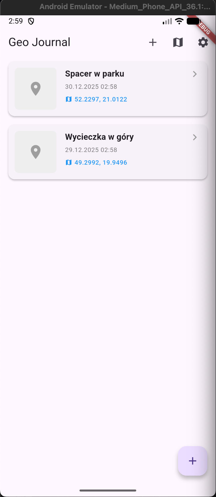 | 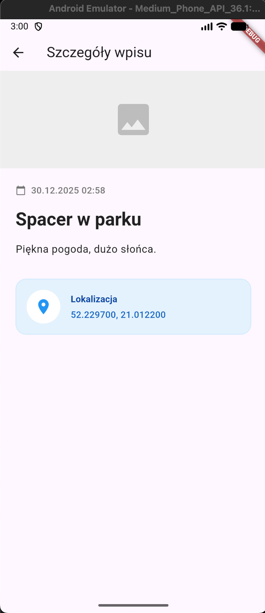 | 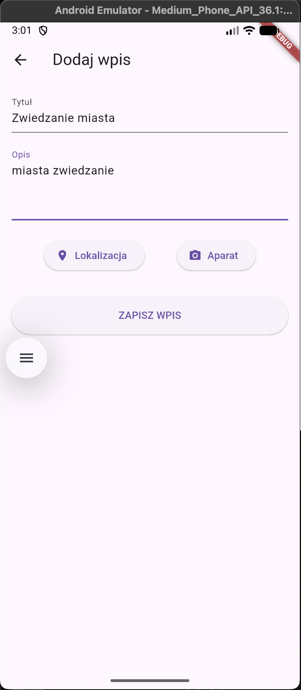 |
|              **Lista wpisów**               |                **Szczegóły**                |             **Widok dodawania**             |

|                 Geo natywna                 |          Dodaj wpis (Lokalizacja)           |               Natywna kamera                |
| :-----------------------------------------: | :-----------------------------------------: | :-----------------------------------------: |
| 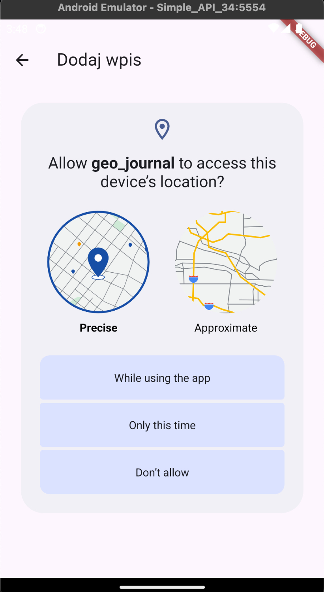 | 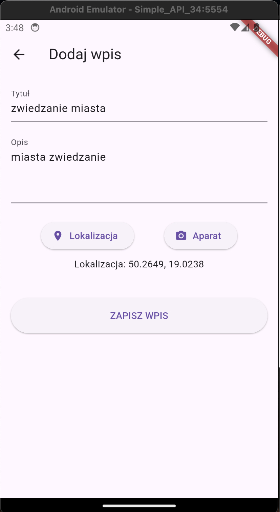 | 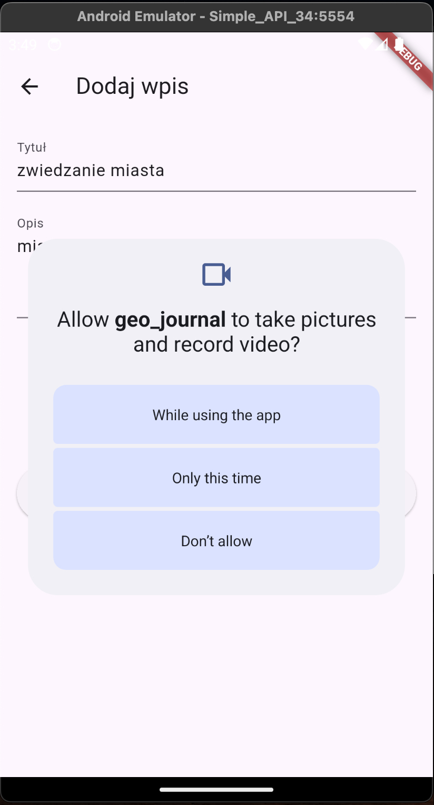 |
|             **Uprawnienia GPS**             |           **Pobrana lokalizacja**           |           **Uprawnienia kamery**            |

|               Obraz z kamery                |        Wpis z obrazem i lokalizacją         |                     Mapa                     |
| :-----------------------------------------: | :-----------------------------------------: | :------------------------------------------: |
| 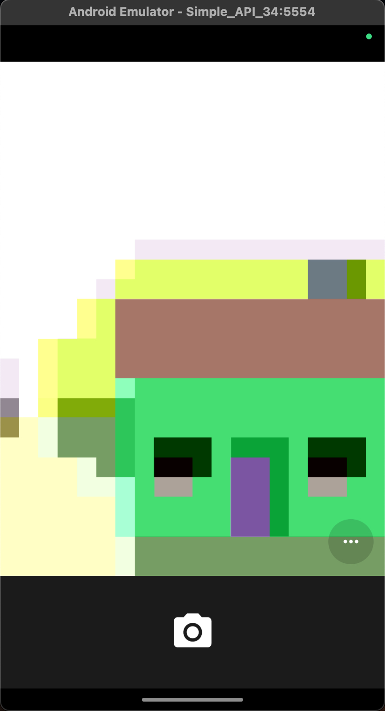 | 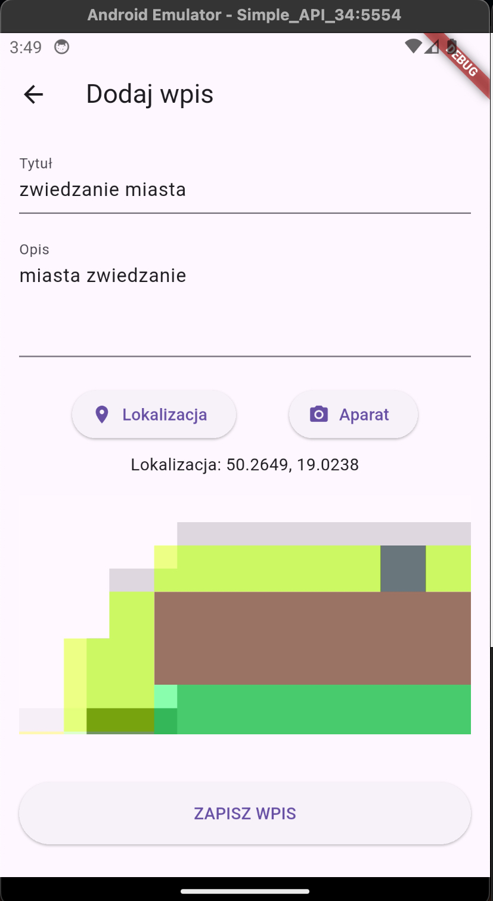 | 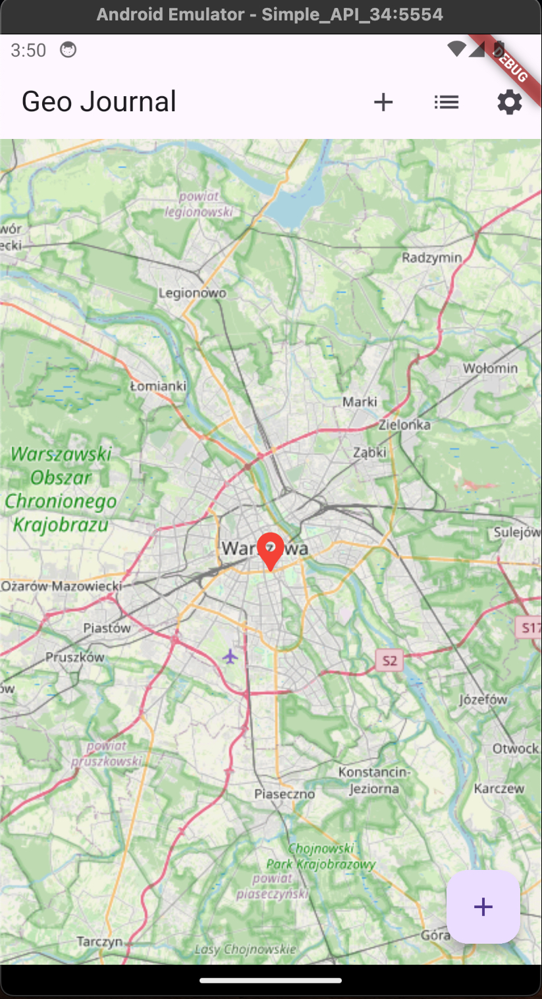 |
|             **Podgląd kamery**              |               **Pełny wpis**                |                **Widok mapy**                |

|                  Ustawienia                  |          Szczegóły wpisu (z listy)           |
| :------------------------------------------: | :------------------------------------------: |
| 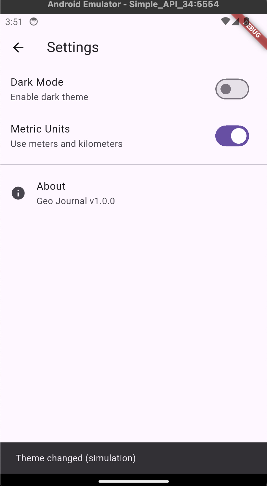 | 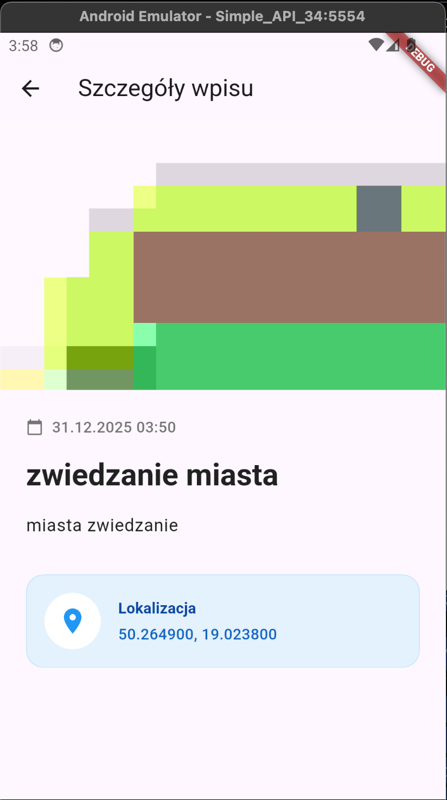 |
|                **Ustawienia**                |                **Szczegóły**                 |
